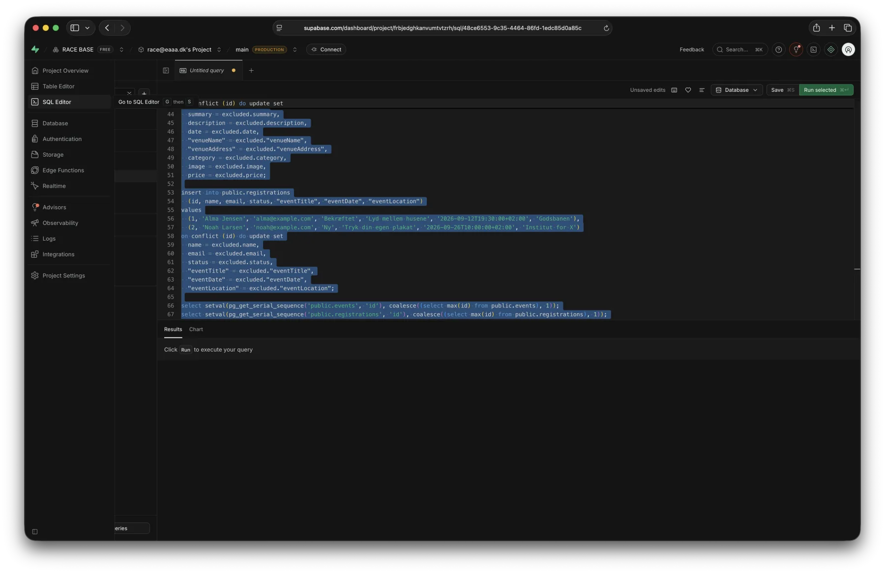
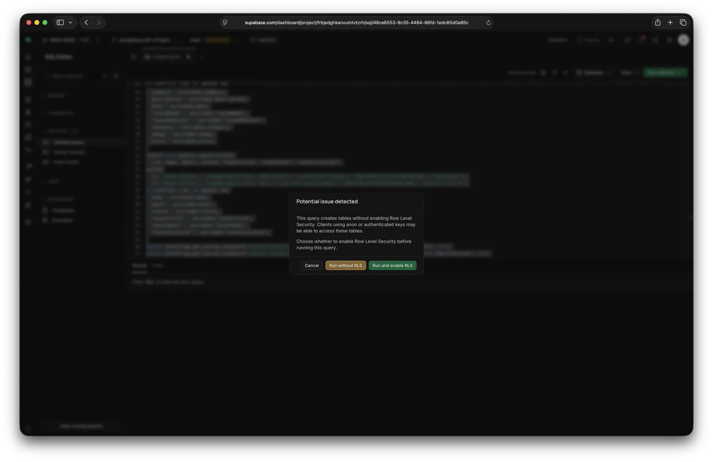
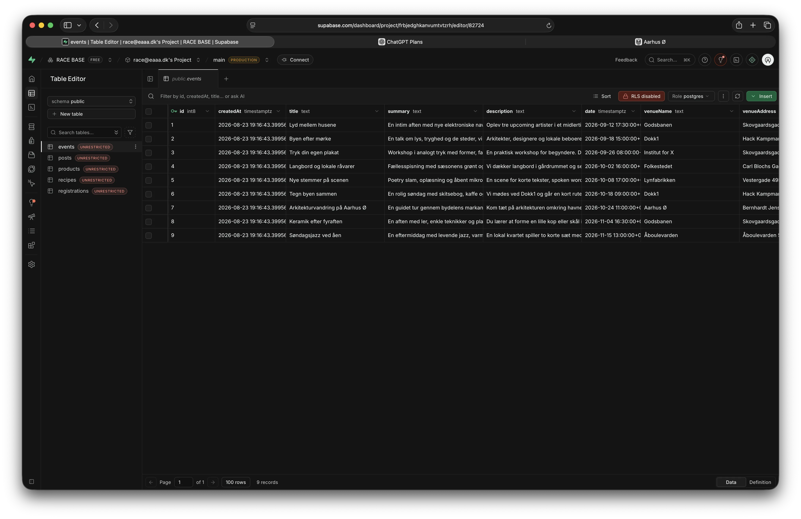
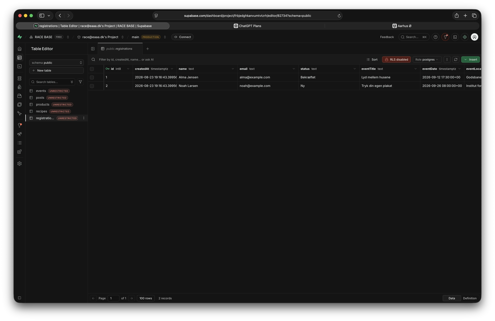
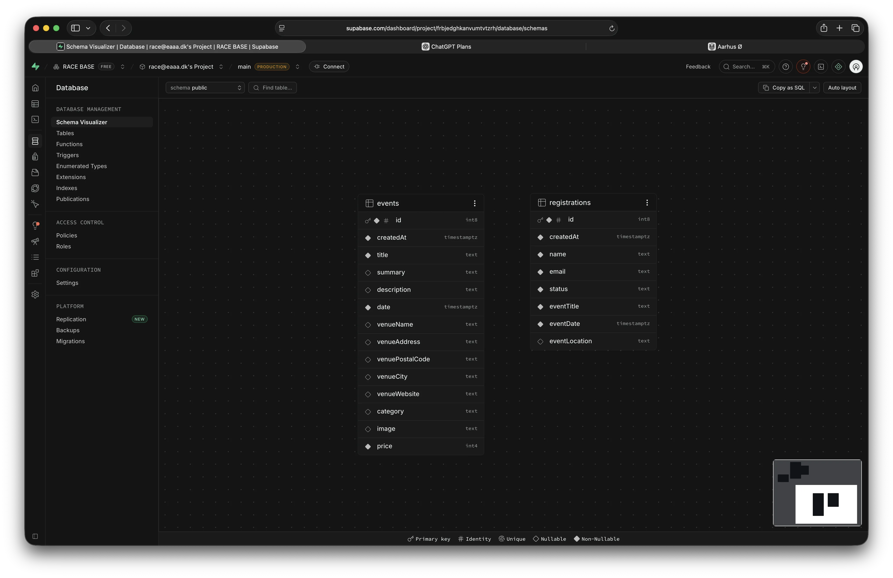
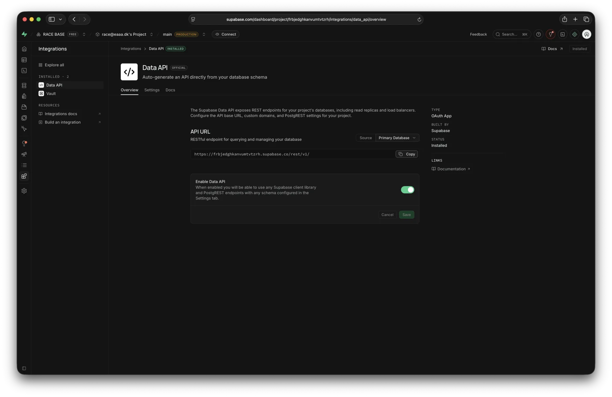
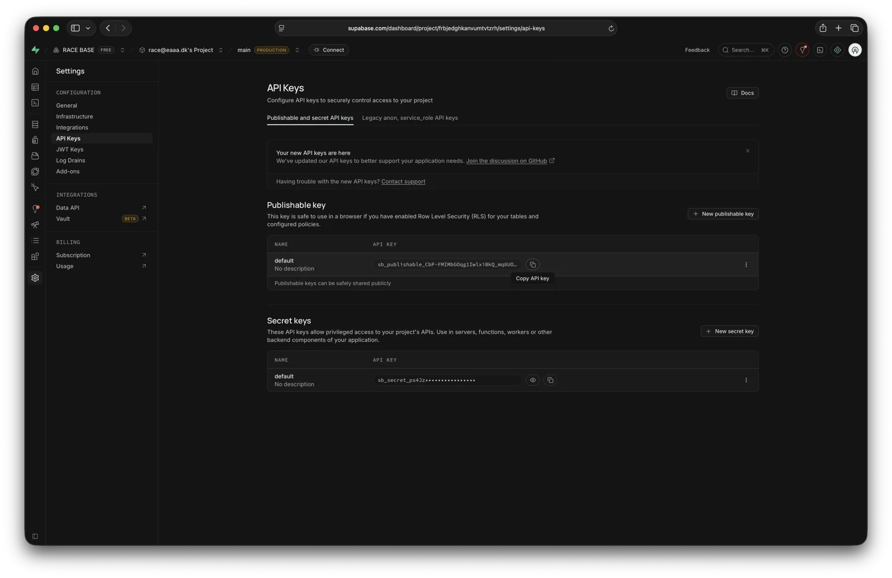

# Mellemrum

Mellemrum er en React-prototype for en lokal kultur- og eventplatform. Projektet er startpunktet for Case 1 i Product Optimization.

Den primære målgruppe er personer, der ønsker en enkel vej til at opdage og tilmelde sig lokale kulturoplevelser i Aarhus. Arrangører er en sekundær målgruppe, som bruger platformen til at dele events og få overblik over tilmeldinger.

Guiden hjælper dig med at få React-projektet til at køre lokalt og forbinde det til dit eget Supabase-projekt. Du behøver ikke kunne skrive SQL for at følge opsætningen.

[Se den udleverede løsning online](https://cederdorff.com/mellemrum/), hvis du vil udforske prototypen, før du sætter projektet op lokalt.

## Det skal du bruge

- Node.js installeret på din computer
- en Supabase-konto
- projektet åbnet i VS Code

## 1. Installér projektet

Åbn terminalen i projektets mappe, og installér dependencies:

```bash
npm install
```

Vent med at starte appen, til Supabase og `.env` er sat op i de næste trin.

## 2. Opret tabeller og startdata i Supabase

Opret et nyt Supabase-projekt, eller åbn det projekt, du skal bruge til casen.

Åbn filen [supabase/starter.sql](supabase/starter.sql) i VS Code. Du skal ikke skrive eller ændre SQL-koden nu. Markér hele filens indhold, og kopiér det.

Gå derefter til **SQL Editor** i Supabase:

1. Opret en ny query.
2. Indsæt hele indholdet fra `starter.sql`.
3. Klik på **Run**.



Hvis Supabase viser advarslen på billedet nedenfor, skal du vælge **Run without RLS** for denne starter.



Det er et bevidst scopevalg i Case 1: Authentication og authorization indgår ikke, og den interne side skal derfor ikke adgangsbeskyttes. Brug kun de udleverede eller andre fiktive testdata – aldrig rigtige personoplysninger.

SQL-filen opretter tabellerne `events` og `registrations` og indsætter de startdata, som appen forventer. Vent, til Supabase viser, at din query er gennemført.

### Kontrollér resultatet

Åbn **Table Editor**, og vælg tabellen `events`. Du bør kunne se ni events.



Vælg derefter tabellen `registrations`. Her bør du kunne se de to starttilmeldinger.



Du kan også åbne **Database → Schema Visualizer**. Her skal du kunne se tabellerne `events` og `registrations`. De har endnu ingen relation til hinanden; det er en del af udgangspunktet for casen. Bemærk også, at flere events bruger samme venue, men gentager `venueName`, `venueAddress`, `venuePostalCode`, `venueCity` og `venueWebsite` direkte på hvert event.



## 3. Forbind React-projektet til Supabase

Kopiér først projektets eksempel på en miljøfil:

```bash
cp .env.example .env
```

Du kan også duplikere `.env.example` i VS Code og omdøbe kopien til `.env`.

Åbn derefter `.env` i VS Code. Du skal indsætte din Supabase API URL og din publishable key.

### Find API URL

Gå til **Integrations → Data API** i Supabase, og kopiér værdien under **API URL**.



Fjern den afsluttende `/`, hvis den følger med. Værdien skal ende på `/rest/v1`.

### Find din publishable key

Gå til **Project Settings → API Keys**, og kopiér projektets **Publishable key**. Brug ikke en key fra området **Secret keys**.



Din `.env` skal nu have denne form:

```bash
VITE_SUPABASE_URL=https://dit-projekt.supabase.co/rest/v1
VITE_SUPABASE_APIKEY=din-publishable-key
```

Gem filen. `.env` er allerede tilføjet til `.gitignore` og skal ikke pushes til GitHub.

## 4. Start appen

Kør udviklingsserveren:

```bash
npm run dev
```

Åbn den adresse, terminalen viser. Det er normalt [http://localhost:5173](http://localhost:5173).

Kontrollér, at:

- forsiden viser events fra Supabase
- du kan åbne en eventside
- siden `/tilmeldinger` viser de eksisterende tilmeldinger

Tilmeldingsformularen logger foreløbig de indtastede værdier i konsollen. Den gemmer endnu ikke tilmeldingen i Supabase.

## 5. Deploy appen

Når løsningen virker lokalt, skal du deploye den til GitHub Pages. Projektet indeholder allerede et GitHub Actions-workflow, som bygger og deployer ved push til `main`.

Før du pusher:

1. Kontrollér, at `base` i `package.json` svarer til navnet på dit GitHub-repository.
2. Opret GitHub Environment `github-pages-deployment`.
3. Tilføj `VITE_SUPABASE_URL` og `VITE_SUPABASE_APIKEY` som **Environment variables** i dette environment.
4. Kør `npm run lint` og `npm run build` lokalt.
5. Push til `main`, og følg deploymenten under **Actions** på GitHub.

Når workflowet er gennemført, skal du åbne den deployede løsning og kontrollere de samme brugerflows som lokalt. Afprøv også direkte links og genindlæsning af undersider.

Se den gennemgåede proces på Canvas: [Web App-forbedringer og teknisk fundament – 19/08/2026](https://eaaa.instructure.com/courses/30922/pages/race-product-optimization-web-app-forbedringer-og-teknisk-fundament-19-08-2026).

## Hvis appen ikke viser data

- Kontrollér, at både `events` og `registrations` findes i Supabase.
- Kontrollér, at API URL ender på `/rest/v1` uden en ekstra `/`.
- Kontrollér, at du har kopieret din publishable key og ikke en secret key.
- Genstart `npm run dev`, hvis du har ændret `.env`, mens serveren kørte.
- Se efter fejl i browserens Console og Network-panel.

## Ruter

- `/` – eventoversigt
- `/events/:eventId` – eventdetalje og tilmelding
- `/om` – om Mellemrum
- `/tilmeldinger` – internt overblik

## Arbejdsform

Arbejd med én sammenhængende forbedring ad gangen i en tydeligt navngivet feature branch. Lav forståelige commits, verificér ændringen, og merge derefter branchen til `main`.

Arbejd ikke direkte på `main`.

## Scripts

```bash
npm run dev
npm run lint
npm run build
npm run preview
```
